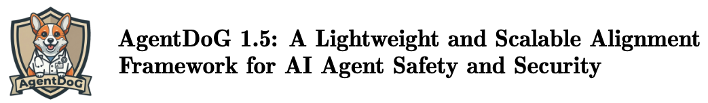
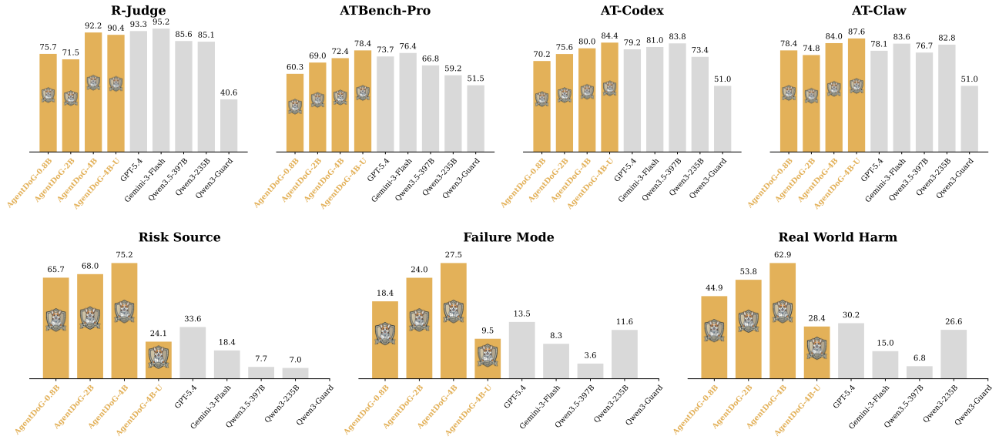
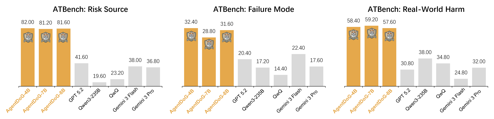

<p align="center">
  
</p>

<p align="center">
  🤗 <a href="https://huggingface.co/collections/AI45Research/agentdog"><b>Hugging Face</b></a>&nbsp;&nbsp; | &nbsp;&nbsp;
  🤖 <a href="https://www.modelscope.cn/collections/Shanghai_AI_Laboratory/AgentDoG">ModelScope</a>&nbsp;&nbsp; | &nbsp;&nbsp;
  📄 <a href="https://arxiv.org/pdf/2601.18491">AgentDoG 1.0 Technical Report</a>&nbsp;&nbsp; | &nbsp;&nbsp;
  📄 <a href="#">AgentDoG 1.5 Technical Report</a>&nbsp;&nbsp; | &nbsp;&nbsp;
  🌐 <a href="https://ai45lab.github.io/AgentDoG/">Project Page</a>
</p>

Visit our Hugging Face or ModelScope organization (click links above), search checkpoints with names starting with `AgentDoG-`, and you will find all you need! Enjoy!


# AgentDoG Family: A Lightweight and Scalable Alignment Framework for AI Agent Safety and Security.

## News

- `2026/xx/xx`: AgentDoG 1.5 is coming soon, introducing lightweight and scalable guardrail models for trajectory-level agent safety.
- `2026/xx/xx`: We extend ATBench into the ATBench Family, covering general tool-use agents, OpenClaw-style stateful agents, and Codex-style repository agents.
- `2026/xx/xx`: AgentDoG 1.5 supports two application settings: safety agentic SFT/RL and online agent safety guardrails.
- `2026/01/26`: We have released [AgentDoG 1.0](docs/readme_v1.md), a diagnostic guardrail framework for AI agent safety and security.

## Introduction

**AgentDoG 1.5** is a cost-effective and extensible **Diagnostic Guardrail** for trajectory-level agent safety assessment, building on the foundation of AgentDoG 1.0. It expands agent safety diagnosis from fixed trajectory classification toward a scalable framework for modern agentic systems with long-horizon planning, tool-mediated execution, and complex environment interaction.

- 🧩 **Extensible Taxonomy for Agentic Safety Diagnosis:** expands the original safety taxonomy into a flexible framework that captures emerging risks from modern agentic AI systems, including long-horizon planning, tool-mediated execution, and complex environment interaction.
- 📚 **Extensible ATBench Family:** refines ATBench into a trajectory-level benchmark family with 1,000 audited trajectories, 2,084 available tools, 1,954 unique invoked tools, and an average of 9.01 turns and 3.95k tokens per trajectory, further instantiated by ATBench-Codex and ATBench-Claw.
- 🛡️ **Cost-Effective Diagnostic Guardrail Models:** trains AgentDoG 1.5 through an efficient data preparation and training pipeline with around 1k SFT trajectories and several thousand RL samples, covering a high-performing 4B variant and lightweight 0.8B and 2B variants.
- 🚀 **Practical Agent Safety Applications:** demonstrates AgentDoG 1.5 in safety-aware agentic SFT/RL and online agent safety monitoring, highlighting its use as a practical safety component for deployed agentic AI systems.

<p align="center">
  
</p>

<p align="center">
  
</p>

---

## Model Zoo

### AgentDoG Family: A Lightweight and Scalable Alignment Framework for AI Agent Safety and Security.

| Name | Parameters | Base Model | HF Link | ModelScope Link |
|------|------------|------------|---------|-----------------|
| AgentDoG1.5-unified-Qwen3.5-4B | 4B | Qwen3.5 | 🤗 [Hugging Face](https://huggingface.co/AI45Research/AgentDoG1.5-unified-Qwen3.5-4B) | Coming soon |
| AgentDoG1.5-Qwen3.5-0.8B | 0.8B | Qwen3.5 | Coming soon | Coming soon |
| AgentDoG1.5-Qwen3.5-2B | 2B | Qwen3.5 | Coming soon | Coming soon |
| AgentDoG1.5-Qwen3.5-4B | 4B | Qwen3.5 | 🤗 [Hugging Face](https://huggingface.co/AI45Research/AgentDoG-1.5-Qwen3.5-4B) | Coming soon |
| AgentDoG1.5-FG-Qwen3.5-0.8B | 0.8B | Qwen3.5 | Coming soon | Coming soon |
| AgentDoG1.5-FG-Qwen3.5-2B | 2B | Qwen3.5 | Coming soon | Coming soon |
| AgentDoG1.5-FG-Qwen3.5-4B | 4B | Qwen3.5 | Coming soon | Coming soon |

### AgentDoG 1.0

| Name | Parameters | Base Model | HF Link | ModelScope Link |
|------|------------|------------|---------|-----------------|
| AgentDoG-Qwen3-4B | 4B | Qwen3-4B-Instruct-2507 | 🤗 [Hugging Face](https://huggingface.co/AI45Research/AgentDoG-Qwen3-4B) | 🤖 [ModelScope](https://www.modelscope.cn/collections/Shanghai_AI_Laboratory/AgentDoG) |
| AgentDoG-Qwen2.5-7B | 7B | Qwen2.5-7B-Instruct | 🤗 [Hugging Face](https://huggingface.co/AI45Research/AgentDoG-Qwen2.5-7B) | 🤖 [ModelScope](https://www.modelscope.cn/collections/Shanghai_AI_Laboratory/AgentDoG) |
| AgentDoG-Llama3.1-8B | 8B | Llama3.1-8B-Instruct | 🤗 [Hugging Face](https://huggingface.co/AI45Research/AgentDoG-Llama3.1-8B) | 🤖 [ModelScope](https://www.modelscope.cn/collections/Shanghai_AI_Laboratory/AgentDoG) |
| AgentDoG-FG-Qwen3-4B | 4B | Qwen3-4B-Instruct-2507 | 🤗 [Hugging Face](https://huggingface.co/AI45Research/AgentDoG-FG-Qwen3-4B) | 🤖 [ModelScope](https://www.modelscope.cn/collections/Shanghai_AI_Laboratory/AgentDoG) |
| AgentDoG-FG-Qwen2.5-7B | 7B | Qwen2.5-7B-Instruct | 🤗 [Hugging Face](https://huggingface.co/AI45Research/AgentDoG-FG-Qwen2.5-7B) | 🤖 [ModelScope](https://www.modelscope.cn/collections/Shanghai_AI_Laboratory/AgentDoG) |
| AgentDoG-FG-Llama3.1-8B | 8B | Llama3.1-8B-Instruct | 🤗 [Hugging Face](https://huggingface.co/AI45Research/AgentDoG-FG-Llama3.1-8B) | 🤖 [ModelScope](https://www.modelscope.cn/collections/Shanghai_AI_Laboratory/AgentDoG) |

For more details, please refer to the AgentDoG technical reports.

---
## ✨ Safety Taxonomy

AgentDoG adopts a three-dimensional safety taxonomy for trajectory-level agent safety diagnosis: **Risk Source**, **Failure Mode**, and **Real-world Harm**. This taxonomy separates where a risk enters the trajectory, how it manifests in the agent's behavior, and what consequence it may produce.

* **Risk Source**: where the risk comes from, such as user input, environmental observations, external tools/APIs/skills, tool feedback, repository artifacts, or the agent's internal logic and failures.
* **Failure Mode**: how the risk influences agent behavior, such as unconfirmed or over-privileged action, flawed planning or reasoning, improper tool use, insecure interaction or execution, unauthorized information disclosure, or misleading and unverified information.
* **Real-world Harm**: what consequence the unsafe behavior may cause, including privacy and confidentiality harm, financial and economic harm, security and system integrity harm, functional and opportunity harm, reputational harm, or compliance, legal, and auditability harm.

In AgentDoG 1.5, we reinterpret the taxonomy not as a static label space, but as a **shared diagnostic scaffold** for evolving agent execution settings. The three high-level dimensions remain fixed, while new settings can be supported through setting-specific customization: adding new leaf categories when new risks emerge, and strengthening inherited categories when existing labels need more precise operational meanings.

This extensible design allows AgentDoG 1.5 to adapt to modern agent systems with persistent sessions, tool and skill execution, approval boundaries, repository artifacts, shell commands, dependency/MCP interactions, workspace mutation, runtime policies, and verification claims, while preserving a consistent trajectory-level diagnostic interface.

---

## ATBench Family

AgentDoG 1.5 extends the original ATBench into a benchmark family for trajectory-level agent safety. The ATBench Family keeps a unified diagnostic protocol while adapting to different agent execution environments.

| Benchmark | Agent Setting | Description | Download |
|-----------|---------------|-------------|----------|
| **ATBench** | General tool-use agents | The base trajectory-level safety benchmark inherited from AgentDoG 1.0. | 🤗 [Hugging Face](https://huggingface.co/datasets/AI45Research/ATBench) |
| **ATBench-Claw** | OpenClaw agents with stateful tool/skill execution | Extends the benchmark to persistent sessions, accumulated traces, and stateful tool execution. | Coming soon |
| **ATBench-Codex** | Codex-style repository and command execution agents | Extends the benchmark to repository modification, shell commands, file operations, and code-execution risks. | Coming soon |

ATBench Family is designed to evaluate whether a guardrail can generalize from general tool-use trajectories to specialized agent environments. It also demonstrates how the three-dimensional taxonomy can be customized for new settings while preserving the same diagnostic interface.

---

## AgentDoG 1.5

AgentDoG 1.5 is a lightweight and scalable alignment framework for AI agent safety and security. It builds on the trajectory-level diagnostic formulation of AgentDoG 1.0 and further emphasizes extensibility, cost-effective deployment, and application-level integration.

### Task Definition

Given a complete or partial agent trajectory, AgentDoG 1.5 predicts whether the trajectory is safe or unsafe. For unsafe trajectories, it can further provide fine-grained diagnostic labels along the three taxonomy dimensions: Risk Source, Failure Mode, and Real-World Harm.

### Data Preparation

AgentDoG 1.5 uses a taxonomy-guided data preparation pipeline to construct diverse agent safety trajectories. The pipeline includes data collection, reasoning chain-of-thought augmentation, data purification, and fine-grained data selection and balancing.

### Training

AgentDoG 1.5 models are trained with supervised fine-tuning and reinforcement learning. The training process aims to improve trajectory-level safety detection, fine-grained diagnosis, and robustness across different agent execution environments.

### Evaluation

AgentDoG 1.5 is evaluated on R-Judge and ATBench using Accuracy, Precision, Recall, and F1-score. We report AgentDoG-series models only.

| Model | R-Judge Acc | R-Judge Prec. | R-Judge Rec. | R-Judge F1 | ATBench Acc | ATBench Prec. | ATBench Rec. | ATBench F1 |
|-------|-------------|---------------|--------------|------------|-------------|---------------|--------------|------------|
| AgentDoG 1.0-4B-Qwen3 | 91.8 | 87.5 | 98.5 | 92.7 | 64.0 | 59.2 | 88.9 | 71.1 |
| AgentDoG 1.5-0.8B-Qwen3.5 | 75.7 | 83.3 | 67.5 | 74.6 | 60.3 | 58.6 | 68.6 | 63.2 |
| AgentDoG 1.5-2B-Qwen3.5 | 71.5 | 78.0 | 64.1 | 70.4 | 69.0 | 70.1 | 65.7 | 67.8 |
| AgentDoG 1.5-8B-Llama-3.1 | 75.5 | 68.6 | 98.8 | 81.0 | 70.9 | 67.1 | 81.2 | 73.5 |
| AgentDoG 1.5-4B-Qwen3.5 | 92.2 | 91.7 | 93.7 | 92.7 | 72.4 | 69.2 | 80.3 | 74.3 |

Fine-grained diagnostic accuracy on ATBench is reported along the three taxonomy dimensions. Avg. is the mean score across Risk Source, Failure Mode, and Real-world Harm.

| Model | Risk Source | Failure Mode | Real-world Harm | Avg. |
|-------|-------------|--------------|-----------------|------|
| AgentDoG 1.0-4B-Qwen3 | 46.8 | 16.5 | 40.6 | 34.6 |
| AgentDoG 1.5-0.8B-Qwen3.5 | 65.7 | 18.4 | 44.9 | 43.0 |
| AgentDoG 1.5-2B-Qwen3.5 | 68.0 | 24.0 | 53.8 | 48.6 |
| AgentDoG 1.5-8B-Llama-3.1 | 72.9 | 24.6 | 52.5 | 50.0 |
| AgentDoG 1.5-4B-Qwen3.5 | 75.2 | 27.5 | 62.9 | 55.2 |

---

## Application 1: Safety Agentic SFT & RL with AgentDoG 1.5

AgentDoG 1.5 can serve as a trajectory-level diagnostic evaluator for improving agent safety through supervised fine-tuning and reinforcement learning.

### Evaluation Setup

AgentDoG 1.5 is used to evaluate safety behavior across multiple agentic benchmarks and environments, including harmful instruction following, tool-use safety, refusal behavior, and multi-step agent execution.

### Agentic SFT

AgentDoG 1.5 can filter and select high-quality safety data for agentic supervised fine-tuning. By evaluating generated trajectories, it helps construct a mixture of safety-critical and benign agentic data.

### Agentic RL

AgentDoG 1.5 can be integrated as an external safety evaluator in agentic reinforcement learning. It provides safety feedback for harmful behavior, unsafe tool usage, and safe refusal behavior.

---

## Application 2: AgentDoG 1.5 as Online Agent Safety Guardrail

AgentDoG 1.5 can also be deployed as an online agent safety guardrail. During agent execution, it can inspect accumulated trajectories before pending actions or final visible responses and flag unsafe behavior before it reaches the user or environment.

### Why Online Agent Guardrails Matter

Agent risks often emerge during intermediate execution rather than only in final responses. Online guardrails are therefore important for detecting unsafe tool calls, prompt leakage, unauthorized actions, and harmful multi-step plans.

### Guardrail Design

AgentDoG 1.5 can be placed before high-risk actions or final replies. It takes the accumulated trajectory as input and returns a safety judgment, optionally with fine-grained diagnostic labels.

### Evaluation

The online guardrail setting evaluates both safety improvement and deployment cost, including detection rate, attack reduction, runtime latency, and integration overhead.

---

## 🚀 Getting Started

AgentDoG 1.0 and AgentDoG 1.5 use different model checkpoints and prompt formats, so their deployment and inference instructions are maintained separately:

- [AgentDoG 1.5 Getting Started](docs/getting_started_v1_5.md)
- [AgentDoG 1.0 Getting Started](docs/getting_started_v1.md)

---

## 📁 Repository Structure

```text
AgentDoG/
├── README.md
├── figures/
├── prompts/
│   ├── v1.0/
│   │   ├── trajectory_binary.txt
│   │   ├── trajectory_finegrained.txt
│   │   └── taxonomy_finegrained.txt
│   └── v1.5/
│       ├── coarse_grained_moderation.txt
│       └── unified_safety_classification.txt
├── examples/
│   ├── run_openai_moderation.py
│   └── trajectory_sample.json
├── AgenticXAI
│   ├── case_plot_html.py
│   ├── component_attri.py
│   ├── README.md
│   ├── run_all_pipeline.sh
│   ├── samples
│   │   ├── finance.json
│   │   ├── resume.json
│   │   └── transaction.json
│   └── sentence_attri.py
```

---

## 🛠️ Customization

* **Edit prompt templates**: `prompts/v1.0/trajectory_binary.txt`, `prompts/v1.0/trajectory_finegrained.txt`, `prompts/v1.5/coarse_grained_moderation.txt`, `prompts/v1.5/unified_safety_classification.txt`
* **Update taxonomy labels**: `prompts/v1.0/taxonomy_finegrained.txt`
* **Change runtime integration**: `examples/run_openai_moderation.py`

---

## 📜 License

This project is released under the **Apache 2.0 License**.

---

## 📖 Citation

If you use AgentDoG or ATBench in your research, please cite:

```bibtex
@article{liu2026agentdog,
  title={AgentDoG: A Diagnostic Guardrail Framework for AI Agent Safety and Security},
  author={Liu, Dongrui and Ren, Qihan and Qian, Chen and Shao, Shuai and Xie, Yuejin and Li, Yu and Yang, Zhonghao and Luo, Haoyu and Wang, Peng and Liu, Qingyu and others},
  journal={arXiv preprint arXiv:2601.18491},
  year={2026}
}

@article{li2026atbench,
  title={ATBench: A Diverse and Realistic Trajectory Benchmark for Long-Horizon Agent Safety},
  author={Li, Yu and Luo, Haoyu and Xie, Yuejin and Fu, Yuqian and Yang, Zhonghao and Shao, Shuai and Ren, Qihan and Qu, Wanying and Fu, Yanwei and Yang, Yujiu and others},
  journal={arXiv preprint arXiv:2604.02022},
  year={2026}
}

@misc{qian2026behind,
      title={The Why Behind the Action: Unveiling Internal Drivers via Agentic Attribution},
      author={Chen Qian and Peng Wang and Dongrui Liu and Junyao Yang and Dadi Guo and Ling Tang and Jilin Mei and Qihan Ren and Shuai Shao and Yong Liu and Jie Fu and Jing Shao and Xia Hu},
      year={2026},
      journal={arXiv preprint arXiv:2601.15075}
}
```

---

## 🤝 Acknowledgements

This project builds upon prior work in agent safety, trajectory evaluation, and risk-aware AI systems.
